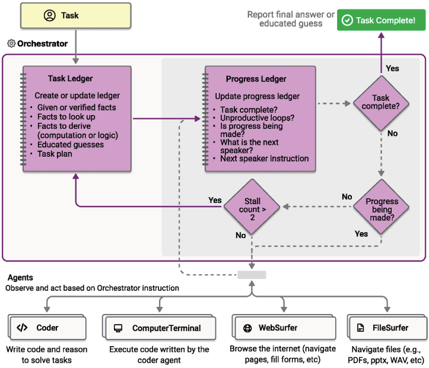

# azure ai agent servie & Autogen workshop

## azure-ai-agent-service

1. function call
[1_function_call](./azure-ai-agent-service-sampleCode/notebooks/1_function_call.ipynb)

2. code interpreter 
[2_Code_Interpreter](./azure-ai-agent-service-sampleCode/notebooks/2_Code_Interpreter.ipynb)

3. grounding with documents
[3_Grounding_with_Documents](./azure-ai-agent-service-sampleCode/notebooks/3_Grounding_with_Documents.ipynb)

4. grounding with bing search
[4_Grounding_with_Bing_Search](./azure-ai-agent-service-sampleCode/notebooks/4_Grounding_with_Bing_Search.ipynb)

## AutoGen workshop 

AutoGen Version 0.4.x is a rewrite of AutoGen from the ground up to create a more robust, extensible, and easy-to-use cross-language library for building agents.

The application interface of AutoGen v0.4.x adopts a hierarchical architecture design, and there are multiple sets of software interfaces to meet the needs of different scenarios

1. Core: event-driven interfaces, core interfaces, and autogen-core interfaces

An event-driven programming framework for building scalable, multi-agent AI systems.

2. AgentChat:task-driven application interface, autogen-agentchat

A programming framework for building sessional single-agent and multi-agent applications, built 
on top of the Core core layer, abstracting many of the underlying system concepts.

3. Extensions: third-party system interfaces, extension packages, autogen-ext

Implementations of Core and AgentChat components that interact with external services or other libraries. You can find and use community extensions or create your own

### 1） basic demo 

Relevant demo code is in the autogen-v0.4.x-sampleCode folder

1. basic

2. team run

3. human feedback

4. human feedback2

### 2） MagenticOne-demo

Magentic-One is a console-based, multi-agent assistant for performing web and file-based tasks. Built on AgentChat.it works based on a multi-Agent architecture, where the chief Orchestrator Agent is responsible for high-level planning, guiding other Agents, and tracking task progress.
The Orchestrator first needs to create a plan to handle the task, collecting necessary facts and informed guesses in the task ledger.At each step of the plan, the Orchestrator creates a progress ledger, reflecting on the task progress and checking if the task is completed.
If the task is not completed, it assigns a subtask to other Agents of Magentic-One to complete. Once the assigned Agent completes the subtask, the Orchestrator updates the progress ledger and continues in this manner until the task is completed.
If the Orchestrator finds the progress insufficient, it can update the task ledger and create a new plan. As shown in the figure above, the Orchestrator's work is divided into an outer loop of updating the task ledger and an inner loop of updating the progress ledger.

2. Relevant demo code is in the MagenticOne-demo folder

3. step:
    pip install -U magentic-one-cli
    input message："我今天的心情非常不错"  Q&A

### 3） AutoGen Studio

The application that allows you to prototype and manage agents without writing code. Built on AgentChat

steps:  
    1) pip install -U autogenstudio 
    
    2) command: autogenstudio ui --port 8081
        
        Support modifying related parameters to customize the application as follows:
        --host Specify the host address, default is localhost
        --appdir Specify the folder to store application files (such as databases and generated user files). Default is the .autogenstudio folder in the user's home directory
        --port Specify the port number. Default is 8080
        --upgrade-database Upgrade the database schema. Default is False
        --reload Enable automatic server reload on code changes. Default is False
        --database-uri Specify the database URI

    3)  use the server: http://localhost:8081/

### AI agent servie & AutoGen

1) one autogen agent delegate the ai agent service's agent.
[AzureAIAgentWithAutoGen-AsTools](./azure-ai-agent-service-with-autogen/1-AzureAIAgentWithAutoGen-AsTools.ipynb)

2) delegated agents work with autogen agent.
[2-AzureAIAgents_Intergration_With_AutoGen_Agents](./azure-ai-agent-service-with-autogen/2-AzureAIAgents_Intergration_With_AutoGen_Agents.ipynb)

